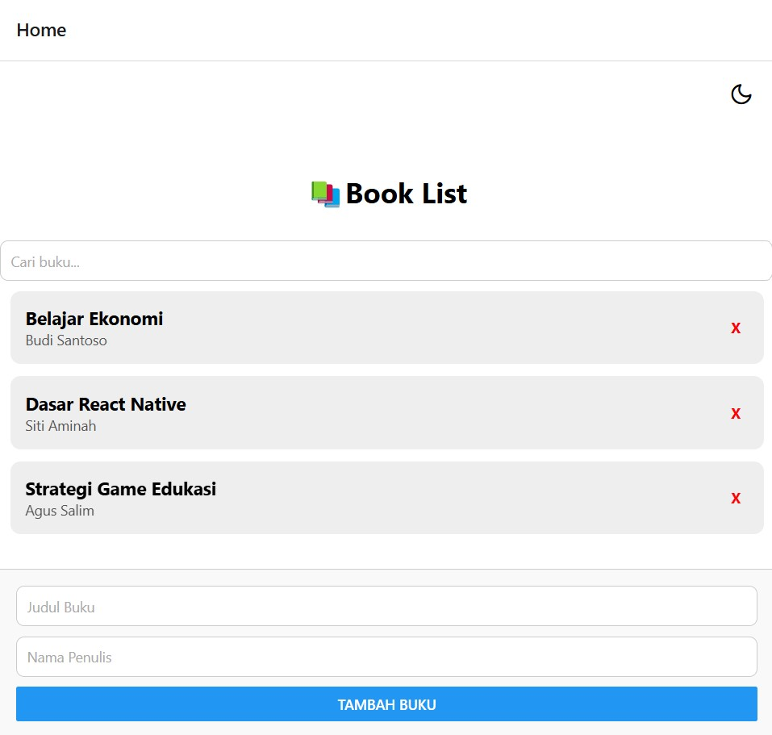

# 📚 BookApp

Aplikasi sederhana untuk mengelola buku

---

## 👤 Pengembang

Nama        : Ronald Triarya Citra
Nim         : 2201020046
Prodi       : Informatika Pagi 2
Repository  : https://github.com/ronaldtcitra/Tugas-Pemrograman-Web-Ronald-46

---

## 🚀 Fitur

- ✅ Menampilkan daftar buku
- ➕ Tambah buku baru
- ❌ Hapus buku dari daftar
- 🔍 Cari buku berdasarkan judul
- 🌗 Dark mode toggle 
- 📄 Menampilkan Deskripsi buku saat buku ditekan

---

## 📁 Struktur Folder (menggunakan Atomic Design)

```
BookApp/
├── assets/
├── src/
│   ├── components/
│   │   ├── atoms/
│   │   ├── molecules/
│   │   └── pages/
│   │       ├── HomePage.js
│   │       └── BookDetailPage.js
│   ├── context/
│   │   └── ThemeContext.js
│   └── navigation/
│       └── AppNavigator.js
├── App.js
└── app.json
```

---

## 📦 Instalasi

1. **Clone repository**
   ```bash
   git clone <https://github.com/ronaldtcitra/Tugas-Pemrograman-Web-Ronald-46>
   cd BookApp
   ```

2. **Install dependencies**
   ```bash
   npm install
   ```

---

## ▶️ Menjalankan Aplikasi

### 📱 Di Expo Go (mobile):

```bash
npx expo start
```

- Scan QR Code menggunakan aplikasi **Expo Go** di Android/iOS.
- Pastikan perangkat dan komputer **terhubung dalam satu jaringan Wi-Fi**.

### 🌐 Di Browser (Web):

```bash
npx expo start --web
```

Jika menggunakan **Expo Dev Tools**, tekan `w` saat terminal terbuka.

---

## 🌍 Mode Jaringan: Tunnel

Untuk bisa diakses oleh orang lain (scan QR dari luar jaringan lokal):

```bash
npx expo start --tunnel
```

---

## 📋 Catatan

- Aplikasi ini menggunakan `react-navigation` untuk berpindah halaman.
- Ikon dark mode menggunakan paket `@expo/vector-icons`.
- Komponen-komponen UI disusun berdasarkan prinsip Atomic Design.

---

## 📸 Preview




---
